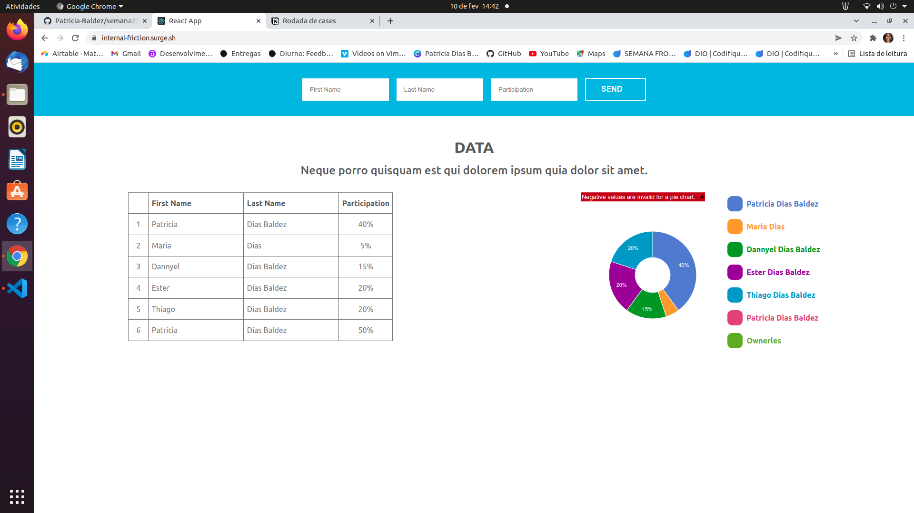

#  { case cubo "desenvolvedor": "fullstack" }

### link do surge: https://internal-friction.surge.sh/

O objetivo deste desafio era avaliar o domínio em desenvolvimento fullstack: organização, estilo e boas práticas com código, criação de APIs, conhecimento de frameworks e tecnologias.

##  Regras

1. https://github.com/future4code/Patricia-Baldez/tree/rodada-cases-semana-23/semana23/cubo-front;
2. Link surge: https://internal-friction.surge.sh/ ;
3. Foi utilizado React js e Node.js;

##  Desafio

###  Front-end

O seguinte layout foi desenvolvodo 

  

###  Back-end

O layout possui um formulário, uma tabela com informações percentuais de participação e um gráfico de pizza que representa essa distribuição.

- APIs que enviam e recebem informações;
- Desenvolver de testes;
- Em caso de inconsistência, retorna o erro em um JSON estruturado com código HTTP 400;

